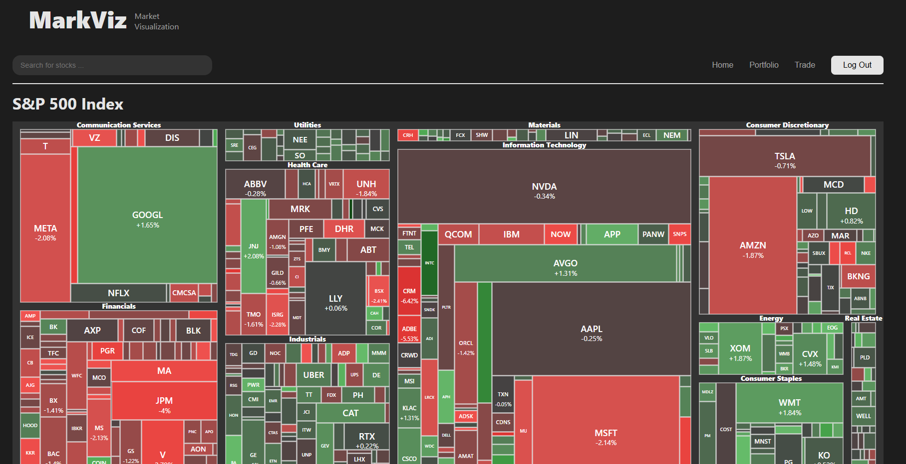
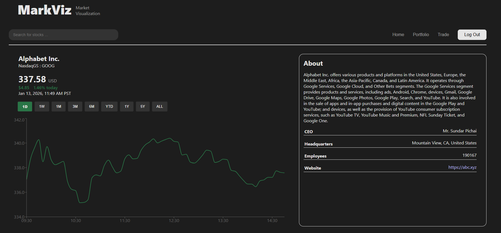
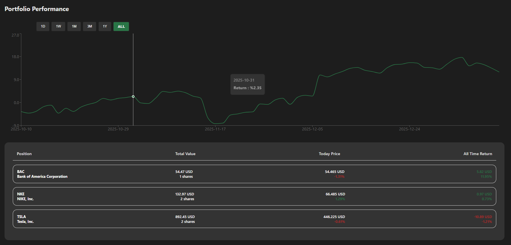
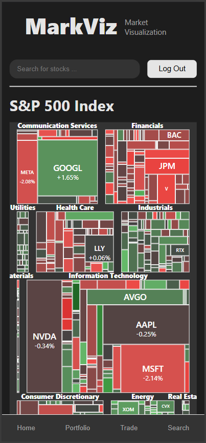

# MarkViz

## Screenshots

### 1. S&P 500 Overview
  
Shows the full list of S&P 500 stocks with key metrics and visualization.

### 2. Individual Stock Page
  
Detailed view of a single stock including chart, fundamentals, and news.

### 3. Portfolio Page
  
User portfolio tracking with holdings, performance summary, and gains/losses.

### 4. Mobile Responsive View
  
App fully responsive on smaller screens — great UX on phone/tablet.

## Features
- Real-time stock data & charts
- S&P 500 treemap visualization
- Individual stock analysis (fundamentals, news, historical prices)
- User portfolio tracking & performance dashboard
- Fully responsive design (mobile + desktop)

## Tech Stack
- **Frontend**: React + Vite + Nginx
- **Backend**: FastAPI (Python) + PostgreSQL
- **Deployment**: Render.com (frontend + backend + database)
- **Other**: Docker, GitHub Actions CI/CD, CORS handling

## Live Demo
- Frontend: https://markviz.onrender.com


## Setup

1. Install dependencies:
```bash
pip install -r requirements.txt
```

2. Create `.env` file (use `.env.example` as template)

3. Run the app:
```bash
uvicorn app.main:app --reload
```

## Run Tests
```bash
pytest
```
